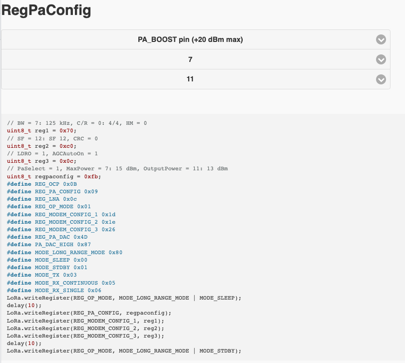

# sx127x_Setup

This is a JS/HTML port of my Xojo app – not on GitHub I believe: a bunch of popup menus that help you configure a Semtech SX127x LoRa chip's registers  to enable various features. I use it mostly to squeeze the best range out of this chip.

This uses the [Highlight JS](https://highlightjs.org/) library as well as [jQuery Mobile](https://jquerymobile.com/), not included here. The app works without them, just, less pretty...

Select the options you need, and the code is written for you :-)

Enjoy!

